# NATS Module

Use the NATS module to manage and configure the message-oriented middleware called NATS.

## What is NATS?

NATS is an infrastructure that enables the exchange of data in form of messages. One of the NATS features is JetStream. JetStream is a distributed persistence system providing more functionalities and higher qualities of service on top of `Core NATS`.

The NATS module ships the NATS Manager, which is responsible for managing the lifecycle of a [NATS JetStream](https://docs.nats.io/nats-concepts/jetstream) deployment. It observes the state of the NATS cluster and reconciles its state according to the desired state.

For more information about NATS and NATS JetStream, see the [official NATS documentation](https://docs.nats.io/).

Kyma Eventing can use NATS as a backend to process events and send them to subscribers.

## Features

* Automated NATS JetStream Deployment: Deploys a production-ready NATS JetStream cluster without manual setup.
* Persistent Messaging: Use file-based storage to ensure messages are retained even if a pod restarts. Memory-based storage is also available for higher throughput scenarios.
* Declarative Configuration: Manage your NATS cluster configuration, including cluster size and storage options, through a simple Kubernetes CR.
* Configurable Resource Allocation: Define specific CPU and memory requests and limits for the NATS pods to fit your cluster's capacity.
* Seamless integration with the Eveniting module.

## Architecture

The NATS module uses a [Kubernetes operator](https://kubernetes.io/docs/concepts/extend-kubernetes/operator/)-based architecture.

1. A user creates a NATS CR.
2. The NATS Manager starts the Controller which creates, watches, and reconciles the following resources:

  - ConfigMap (cm)
  - Secret (sc)
  - Service (sv)
  - Stateful Set (sts)
  - DestinationRule (dr)

3. The Controller reacts to changes of the NATS CR to adapt the resources mentioned above to the desired state.

### NATS Manager

The NATS Manager. The NATS Manager is responsible for starting the Controller which creates, watches, and reconciles the relevant resources.

## API/Custom Resource Definitions

The `nats.operator.kyma-project.io` CustomResourceDefinition (CRD) describes the the NATS custom resource (CR) that NATS Manager uses to managed the module. See [NATS Custom Resource](01-nats-custom-resource.md).

## Resource Consumption

To learn more about the resources used by the NATS module, see [NATS](https://help.sap.com/docs/btp/sap-business-technology-platform-internal/kyma-modules-sizing?state=DRAFT&version=Internal#nats).
